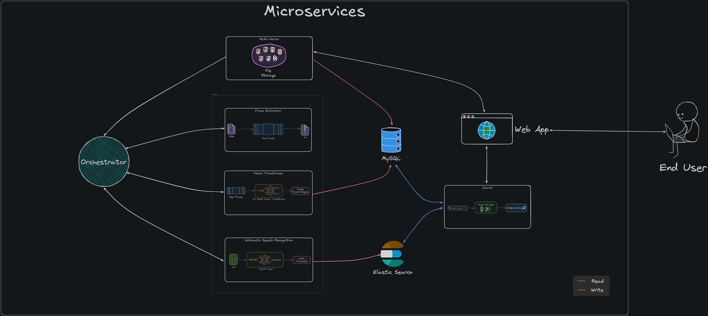

# Video Search Engine: Master Documentation  

## Overview  
The **Video Search Engine** is a modular, multi-service system designed for efficient searching, indexing, and classification of multimedia files, including videos, images, audio, and text. It enables users to perform advanced searches using natural language queries and retrieve results based on visual content, audio transcripts, and metadata. The system uses a microservice-based architecture for scalability and modularity, with each service handling specific responsibilities.  

## Features  
- **Natural Language Query Support**: Users can search using plain text queries.  
- **Video Frame Extraction**: Identifies keyframes for analysis and classification.  
- **Image Classification**: Classifies extracted frames into categories using Vision Transformer (ViT).  
- **Speech Recognition**: Extracts and indexes audio transcripts for text-based searches.  
- **Search Across Media Types**: Combines video, audio, and textual data for comprehensive results.  
- **Local Deployment**: Modular architecture that works on consumer-grade systems with minimal setup.  

## System Architecture  

### Key Components  
1. **Frontend Web Server**: React-based UI for users to interact with the system.  
2. **Media Server**: Stores and serves multimedia files.  
3. **Frame Extractor**: Extracts keyframes from videos using SSIM and MSE metrics.  
4. **Vision Transformer Service**: Classifies images into predefined categories and indexes in MySQL.  
5. **Speech Recognition Service**: Converts audio to text and indexes transcripts in Elasticsearch.  
6. **Search Service**: Combines results from MySQL and Elasticsearch for comprehensive search output.  

## Workflow  

1. **File Upload**: The user uploads a video or image or audio file via the frontend web application. The file is sent to the **Media Server** for storage.  
2. **Processing Pipeline**: The uploaded file is sent through various services:  
    - The **Frame Extractor** extracts keyframes from videos.  
    - The **Vision Transformer Service** classifies the keyframes.  
    - The **Speech Recognition Service** extracts audio transcripts (if applicable).  
3. **Indexing**: The classification and transcription results are indexed in MySQL and Elasticsearch for efficient searching.  
4. **Search Query**: A user enters a search query, which is interpreted by the **Search Service** using NLP to match the most relevant multimedia files.  
5. **Results Delivery**: A consolidated JSON response with matching videos is sent to the frontend.  

## Services  

### 1. **Frontend Web Application**  
[**Frontend Repository**](https://github.com/iam-VK/frontend_web_app)  
- **Description**: React-based web application that provides an interface for uploading files and performing searches.  
- **Port**: 5000  
- **Setup**:  
  - `./setup.sh`: Installs dependencies.  
  - `./run.sh`: Starts the server.  

---

### 2. **Media Server**  
[**Media Server Repository**](https://github.com/iam-VK/media_server)  
- **Description**: Manages storage and retrieval of uploaded media files.  
- **Key Features**:  
  - Stores videos and other media in a structured format.  
  - Provides APIs for file upload and retrieval.  
- **Port**: 5004  

---

### 3. **Frame Extractor**  
[**Frame Extractor Repository**](https://github.com/iam-VK/frame_extractor)  
- **Description**: Extracts keyframes from videos using SSIM and MSE to identify significant frames.  
- **Key Features**:  
  - Optimized for different video resolutions and lengths.  
  - Supports standalone and chained modes.  
- **Port**: 5002  

---

### 4. **Vision Transformer Service**  
[**Vision Transformer Repository**](https://github.com/iam-VK/Vision_Transformer_service)  
- **Description**: Classifies images (keyframes) into categories using a pretrained Vision Transformer (ViT).  
- **Key Features**:  
  - Assigns ImageNet-like labels to video keyframes.  
  - Returns classification results in JSON format.  
- **Port**: 5003  

---

### 5. **Speech Recognition Service**  
[**Speech Recognition Repository**](https://github.com/iam-VK/speech-recog)  
- **Description**: Extracts and transcribes audio from videos, indexing transcripts for text-based search.  
- **Key Features**:  
  - Extracts audio from video files and converts it to text.  
  - Stores transcripts in Elasticsearch and updates indexing state in MySQL.  
  - Supports standalone and database modes.  
- **Port**: 5005  

---

### 6. **Search Service**  
[**Search Service Repository**](https://github.com/iam-VK/search_service)  
- **Description**: Combines data from MySQL and Elasticsearch to provide relevant search results.  
- **Key Features**:  
  - Processes natural language queries and maps them to tags.  
  - Merges results from video classification and audio transcript indexing.  
- **Port**: 5001  

## Technologies Used  
- **Backend**: Flask, Python  
- **Frontend**: React, JavaScript  
- **Database**: MySQL, Elasticsearch  
- **Machine Learning (LLMs)**: Vision Transformer, ASR (Automatic Speech Recognition) models  
- **Tools**: Git, Docker, Postman

## Setup and Deployment  
1. Clone each microservice's repository.  
2. Follow the individual service setup instructions in their respective READMEs.  
3. Use Docker for containerized deployment (if required).  

## Repositories for Microservices  

| **Service**                | **Repository Link**     |  
|-----------------------------|-------------------------|  
| **Frontend Web Server**     | [Frontend Repo](https://github.com/iam-VK/frontend_web_app)      |  
| **Media Server**            | [Media Server Repo](https://github.com/iam-VK/media_server)  |  
| **Frame Extractor**         | [Frame Extractor Repo](https://github.com/iam-VK/frame_extractor) |  
| **Vision Transformer**      | [Vision Transformer Repo](https://github.com/iam-VK/Vision_Transformer_service) |  
| **Speech Recognition**      | [Speech Recognition Repo](https://github.com/iam-VK/speech-recog) |  
| **Search Service**          | [Search Service Repo](https://github.com/iam-VK/search_service) |  

## Future Enhancements  
- Add cloud deployment support for remote accessibility.  
- Integrate more advanced NLP models for better query interpretation.  
- Enhance indexing to support additional file formats like text and PDFs.  
- Explore GPU support for faster processing of ML models.  

---  

This documentation provides a comprehensive understanding of the **Video Search Engine** project and its modular architecture. Explore the linked repositories for individual service details and setup instructions.